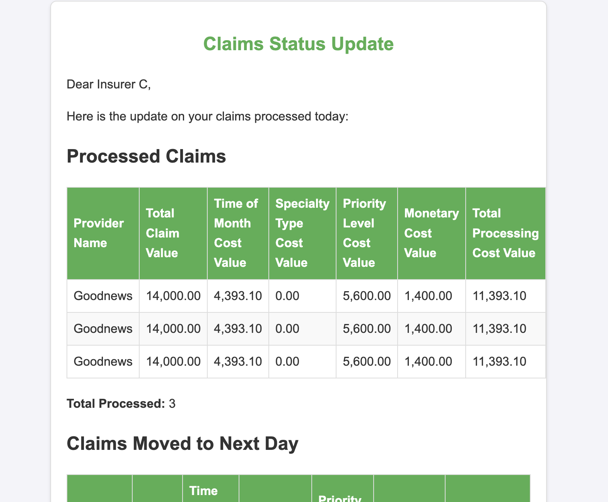
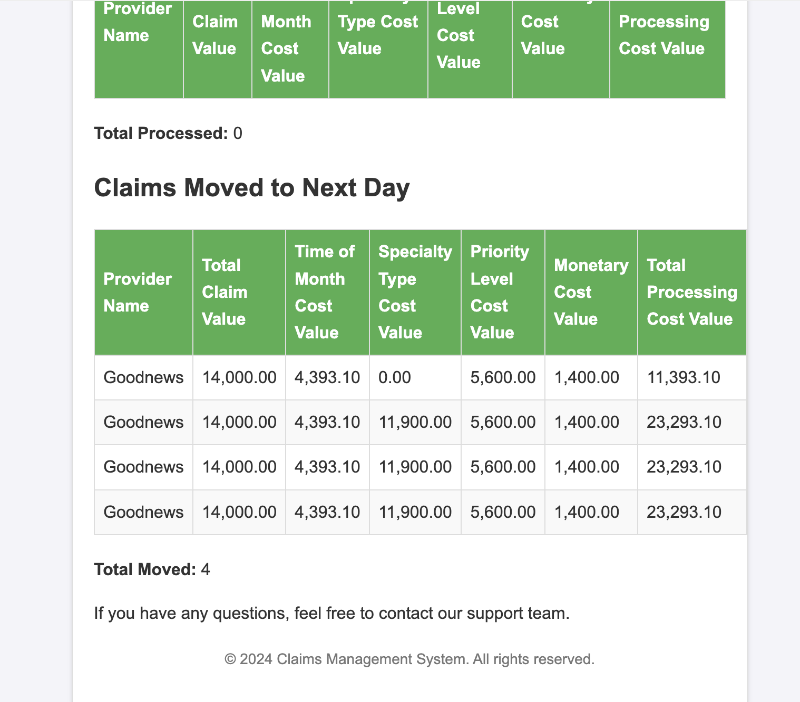
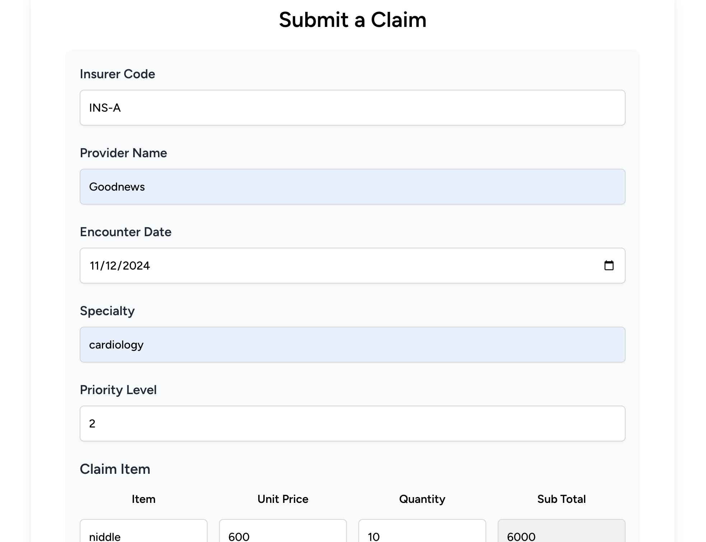
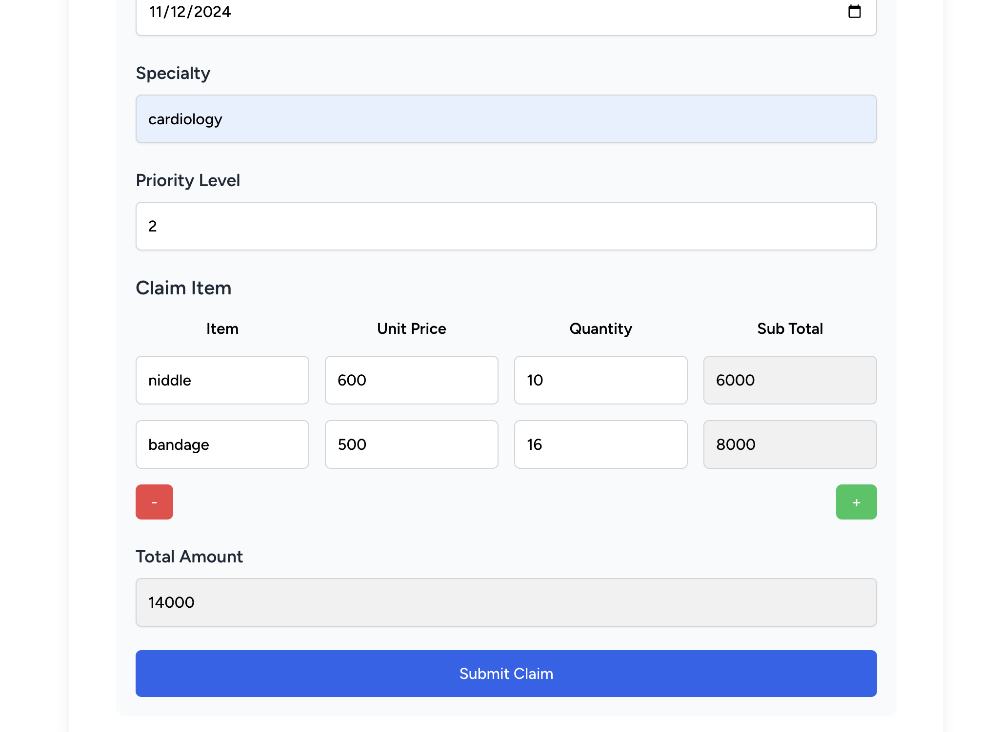

## Setup

Same way you would install a typical laravel application.

    composer install

    npm install

    npm run dev

    php artisan serve

The UI is displayed on the root page

## Extra Notes

# ProcessingClaimCommand Overview

## Description

The `ProcessingClaimCommand` is a Laravel console command designed to process insurance claims in batches, based on each insurer's predefined batch size. The command ensures that claims are efficiently processed while adhering to the batch processing rules for each insurer. Below is a breakdown of how the command works.

## Workflow

1. **Claims Grouping:**
    - The command retrieves claims that are `pending` and have not yet been processed, grouping them by the insurer's `insurer_code`.

2. **Batch Size Logic:**
    - If the number of claims is less than the insurer's minimum batch size, the claims are moved to the next day without being processed.
    - If the claims count falls within the insurer's acceptable batch size range, all claims are processed (i.e., marked as `processed` and their status is updated).
    - If there are more claims than the maximum allowed batch size, only the maximum batch size of claims are processed, and the rest are moved to the next day.

3. **Email Notifications:**
    - After processing, an email is sent to the insurer, detailing the claims that were either processed or moved to the next day.

4. **Logging:**
    - The command logs detailed information about the processing status, including whether claims were processed or moved to the next day, and the respective counts.

## Purpose

This command helps ensure that claims are processed in accordance with the insurer's specific batch size limits, improving performance and avoiding potential processing delays. The email notifications keep insurers updated on the status of their claims.

## Usage

To run the command, use the following Artisan command:

## COMMAND
php artisan process:claims

## Images

